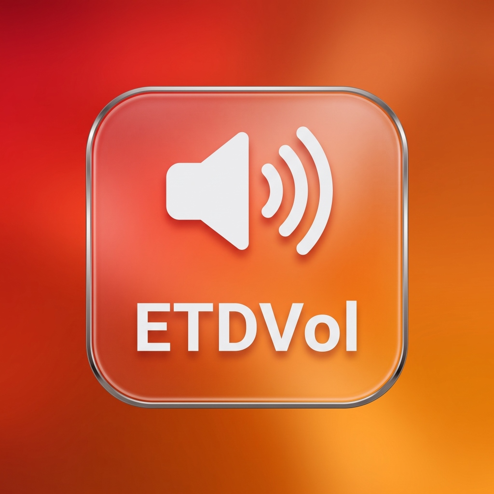

<div align="center">

# 🔊 ETDVol



### Ultra-lightweight, zero-latency taskbar volume control & audio device switcher for Windows

[](LICENSE)
[](#)
[](#)
[](#-language--dil)
[](https://github.com/emirtugra-dag/ETDVol/releases/tag/v1.0.0)

</div>

---

## 💾 Direct Downloads / Doğrudan İndirme

* ⚙️ **Setup / Kurulum Sihirbazı**: [Download ETDVol_Setup.exe](https://github.com/emirtugra-dag/ETDVol/releases/download/v1.0.0/ETDVol_Setup.exe) *(Recommended / Tavsiye Edilen)*

---

## 🌐 Language / Dil

* [English](#-english)
* [Türkçe](#-türkçe)

---

## 🇬🇧 English

### 🌟 Key Features

* 🔊 **Taskbar Mouse Scroll Volume Control**: Adjust master volume instantly by scrolling the mouse wheel anywhere over the Windows Taskbar.
* 🎧 **Instant Audio Device Switching**: Press `Shift + Middle Click (Mouse Wheel Click)` on the Taskbar to switch seamlessly between your audio playback devices (Headphones, Speakers, etc.).
* 🖥️ **Sleek On-Screen Display (OSD)**: Displays a clean, non-intrusive OSD at the bottom of your screen showing the active device name and current volume percentage.
* 🚫 **No Native Windows OS Flyout Spikes**: 100% smooth background volume control using Windows CoreAudio COM API without invoking ugly OS flyout overlays.
* ⚙️ **Comprehensive Settings Window**: Easily configure volume step size (1%-10%), dynamic acceleration, OSD duration, system tray icon, and choose which audio devices to include in the cycle loop.
* 🌐 **Bilingual Support**: Built-in instant language toggle between English and Turkish (`TR | EN`).
* 📦 **Single-File Native Installer**: Standalone setup wizard (`ETDVol_Setup.exe`) with custom installation folder selection, Windows autostart configuration, and Control Panel integration.

### ⌨️ Mouse Shortcuts

| Action | Shortcut | Description |
| :--- | :--- | :--- |
| **Adjust Volume** | `Taskbar Scroll Up / Down` | Increases or decreases master volume |
| **Switch Audio Device** | `Shift + Taskbar Middle Click` | Cycles to the next enabled audio playback device |
| **Open Settings** | `Click OSD` / `Tray Double Click` | Opens the ETDVol Settings window |

### 🏗️ Solution Architecture & Build

ETDVol consists of 3 modular projects targetting `.NET 8.0-windows`:

1. **`ETDVol.csproj`**: Core background service, Windows low-level mouse hooks, volume engine & OSD indicator.
2. **`ETDVol.Setup.csproj`**: Standalone installer wizard packaging embedded binaries into a single executable (`ETDVol_Setup.exe`).
3. **`ETDVol.Uninstall.csproj`**: Standalone uninstaller (`Uninstall.exe`) handling file and registry cleanup.

```bash
# Build & Publish Commands
dotnet publish -c Release ETDVol/ETDVol.csproj -o ETDVol/bin/Release/net8.0-windows/win-x64/publish
dotnet publish -c Release ETDVol.Uninstall/ETDVol.Uninstall.csproj -o ETDVol.Uninstall/bin/Release/net8.0-windows/win-x64/publish
dotnet publish -c Release ETDVol.Setup/ETDVol.Setup.csproj -o Publish
```

---

## 🇹🇷 Türkçe

### 🌟 Öne Çıkan Özellikler

* 🔊 **Görev Çubuğunda Fare Tekerleği İle Ses Kontrolü**: Fare imleciniz Windows Görev Çubuğunun üzerindeyken tekerleği yukarı/aşağı çevirerek ana ses seviyesini anında değiştirin.
* 🎧 **Anında Ses Cihazı Değiştirme**: Görev Çubuğu üzerinde `Shift + Fare Orta Tuşuna (Tekerlek Tıklaması)` basarak bağlı ses çıkış cihazlarınız (Kulaklık, Hoparlör vb.) arasında doğrudan geçiş yapın.
* 🖥️ **Şık Görsel Gösterge (OSD)**: Ses veya cihaz değiştiğinde ekranın alt kısmında aktif cihaz adını ve ses yüzdesini gösteren modern OSD paneli belirir.
* 🚫 **Çirkin Windows Siyah Paneli Çıkmaz**: Windows CoreAudio COM API seviyesinde doğrudan ses kontrolü yapılarak ekranın sol üstünde çıkan çirkin varsayılan Windows panelleri tamamen engellenmiştir.
* ⚙️ **Kapsamlı Ayarlar Menüsü**: Ses değişim adımını (%1-%10), ivmelenmeyi, OSD gösterim süresini, sistem tepsisi simgesini ve döngüye dahil edilecek cihazları kolayca özelleştirin.
* 🌐 **Çift Dil Desteği**: Türkçe ve İngilizce dilleri arasında anında geçiş imkanı.
* 📦 **Tek Parça Kurulum Sihirbazı**: Özelleştirilebilir kurulum klasörü, Windows başlangıç tercihi ve Denetim Masası Program Ekle/Kaldır entegrasyonu sunan `ETDVol_Setup.exe`.

### ⌨️ Fare Kısayolları

| Eylem | Kısayol | Açıklama |
| :--- | :--- | :--- |
| **Ses Ayarlama** | `Görev Çubuğunda Scroll` | Sesi derece derece artırır veya azaltır |
| **Cihaz Değiştirme** | `Shift + Görev Çubuğunda Orta Tuş` | Bir sonraki kayıtlı ses cihazına geçer |
| **Ayarları Açma** | `OSD'ye Tıklama` / `Tepsi Çift Tık` | ETDVol Ayarlar penceresini açar |

---

## 📄 License / Lisans

This project is licensed under the terms of the custom **[ETDVol License](LICENSE)**:

1. **Disclaimer of Liability / Sorumluluk Reddi**: Provided "AS-IS" without warranty of any kind. The author holds zero liability for any damages or system issues.
2. **Trademark & Logo Restrictions / Marka Kısıtlaması**: The name **"ETDVol"**, official icons, logos, and visual branding assets are reserved property and may NOT be used, modified, or re-distributed for commercial products or derivative works without explicit written permission.
